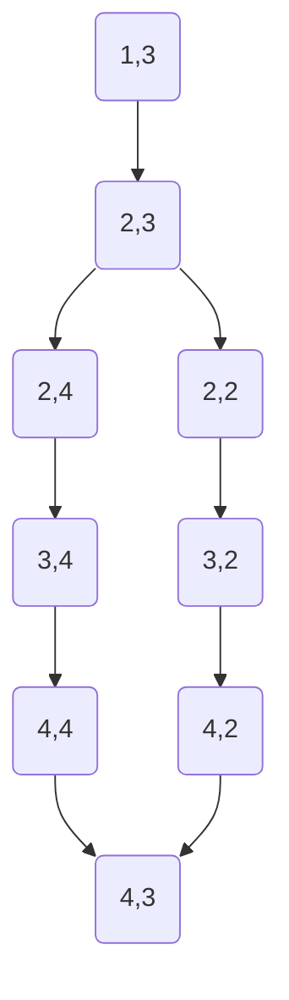

# Promenons-nous dans les bois

Le sujet a ici été rappelé pour des questions pratiques, le rapport commence réellement à la section [Méthode-de-résolution](#méthode-de-résolution).


> *Promenons-nous dans les bois,*  
> *Pendant que le loup n'y est pas.*  
> *Si le loup y était*  
> *Il nous mangerait,*  
> *Mais comme il y est pas,*  
> *Il nous mangera pas.*  
> *Loup, y es-tu ?*  
> *Que fais-tu ?*  
> *M'entends-tu ?*
---

### Contexte

Il s'agit de simuler un (ou des enfants) qui cartographie une forêt en chantant la comptine *"Promenons-nous dans les
bois"*.

- À chaque phrase prononcée par l'enfant, il a le droit d'avancer dans la forêt (déplacement possible sur les 8 cases
  adjacentes).
- Au bout d'un moment (dépendant du nombre de vêtements que le loup enfilera avant de sortir, ce nombre est
  naturellement aléatoire), le loup sort de sa cachette et révèle sa position.
- À partir de ce moment, il se déplace dans la forêt à la recherche des enfants.  
  Le loup n'est pas bloqué par les arbres et peut se déplacer sur toute la carte.
- L'enfant doit retourner à sa position de départ (ou autre, à vous de décider) avant de se faire manger.
- S'il ne s'est pas fait manger, il peut retourner dans la forêt et poursuivre sa cartographie.
- La forêt est représentée par un fichier `.txt`.  
  Les `'1'` sont des arbres (infranchissables par l'enfant) et les espaces `' '` des chemins praticables.

---

### Fichiers fournis

- Le code de départ contenant :
    - le déroulement de la comptine
    - la gestion du loup
- Les fichiers :
    - `comptine.txt`
    - `vetements.txt`
    - `foret1.txt` à `foret5.txt`

---

### Travail demandé

- Un fichier au format **Mermaid (.mmd)** représentant les chemins découverts par l'enfant.

```
%% Exemple de graphe généré pour la forêt ci-dessous :
%% 11 11
%% 1   1
%% 1 1 1
%% 1   1
%% 11111

graph TD
    1(1,3) --> 2(2,3)
    2 --> 3(2,4)
    3 --> 4(3,4)
    4 --> 5(4,4)
    2 --> 6(2,2)
    6 --> 7(3,2)
    7 --> 8(4,2)
    5 --> 9(4,3)
    8 --> 9
```



## Méthode de résolution

Pour résoudre ce problème, on a choisi de structurer le programme en deux APIs internes, ainsi que d'utiliser l'algorithme dit "du mur de droite" pour parcourir la forêt.

### API interne

Par simplicité d'utilisation en ce qui concerne le graphe, le choix a été fait de segmenter les structures de `Forêt` et de `Graph` afin de les cacher derrière des headers internes. Ceux-ci fournissent :

- un type opaque
- des fonctions permettant d'effectuer des opérations sur ce type opaque

### Implémentation du graphe

Pour implémenter le graphe, on a utilisé une structure encapsulant deux listes simplement chaînées, une gouvernant les points du graphe, l'autre ses arrêtes. Cette implémentation a été choisie à cause de la non-connaissance de la taille maximale de cette liste et de celle des arrêtes, on a choisi d'utiliser une structure extensible pour l'implémentation.

La structure de graphe gère aussi le formatage mermaid du graphe ainsi que du chargement, à la simple condition de lui donner un fichier valide et ouvert.

La forêt, elle, est encapsulée dans une structure dédiée, de sorte à camoufler le fonctionnement de la structure. Cette structure ne contient qu'un tableau à double entrée pour représenter les forêts, on partira du principe que les dimensions sont contenues dans les constantes de `wolf.h` et que le fichier s'y conforme, sans quoi il sera tronqué (la méthode du gigot, pas besoin de la présenter je pense).

### Algorithme de pathfinding

Pour que l'enfant puisse parcourir la forêt, plusieurs algorithmes ont été considérés. Le premier a été *A-star*, mais avec une profondeur de seulement 1, une première implémentation n'a pas été probante. Suivre le mur de droite aurait été la solution idéale, mais par manque de temps, on s'est rabattus sur l'implémentation d'un tâcheron.

Celle-ci se contente de parcourir chaque case, une par une, sans en éviter aucune. On s'arrête uniquement quand aucun choix n'est possible, soit que toute la carte a été parcourue.
