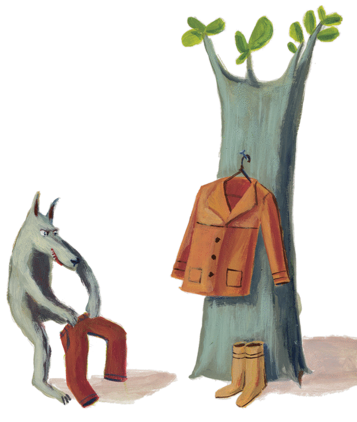

# Promenons-nous dans les bois



> *Promenons-nous dans les bois,*  
> *Pendant que le loup n'y est pas.*  
> *Si le loup y était*  
> *Il nous mangerait,*  
> *Mais comme il y est pas,*  
> *Il nous mangera pas.*  
> *Loup, y es-tu ?*  
> *Que fais-tu ?*  
> *M'entends-tu ?*
---

### Contexte

Il s'agit de simuler un (ou des enfants) qui cartographie une forêt en chantant la comptine *"Promenons-nous dans les
bois"*.

- À chaque phrase prononcée par l'enfant, il a le droit d'avancer dans la forêt (déplacement possible sur les 8 cases
  adjacentes).
- Au bout d'un moment (dépendant du nombre de vêtements que le loup enfilera avant de sortir, ce nombre est
  naturellement aléatoire), le loup sort de sa cachette et révèle sa position.
- À partir de ce moment, il se déplace dans la forêt à la recherche des enfants.  
  Le loup n'est pas bloqué par les arbres et peut se déplacer sur toute la carte.
- L'enfant doit retourner à sa position de départ (ou autre, à vous de décider) avant de se faire manger.
- S'il ne s'est pas fait manger, il peut retourner dans la forêt et poursuivre sa cartographie.
- La forêt est représentée par un fichier `.txt`.  
  Les `'1'` sont des arbres (infranchissables par l'enfant) et les espaces `' '` des chemins praticables.

---

### Fichiers fournis

- Le code de départ contenant :
    - le déroulement de la comptine
    - la gestion du loup
- Les fichiers :
    - `comptine.txt`
    - `vetements.txt`
    - `foret1.txt` à `foret5.txt`

---

### Travail demandé

- Un fichier au format **Mermaid (.mmd)** représentant les chemins découverts par l'enfant.

```
%% Exemple de graphe généré pour la forêt ci-dessous :
%% 11 11
%% 1   1
%% 1 1 1
%% 1   1
%% 11111

graph TD
    1(1,3) --> 2(2,3)
    2 --> 3(2,4)
    3 --> 4(3,4)
    4 --> 5(4,4)
    2 --> 6(2,2)
    6 --> 7(3,2)
    7 --> 8(4,2)
    5 --> 9(4,3)
    8 --> 9
```   

```mermaid
%% Exemple de graphe généré pour la forêt ci-dessous :
%% 11 11
%% 1   1
%% 1 1 1
%% 1   1
%% 11111

graph TD
    1(1,3) --> 2(2,3)
    2 --> 3(2,4)
    3 --> 4(3,4)
    4 --> 5(4,4)
    2 --> 6(2,2)
    6 --> 7(3,2)
    7 --> 8(4,2)
    5 --> 9(4,3)
    8 --> 9
